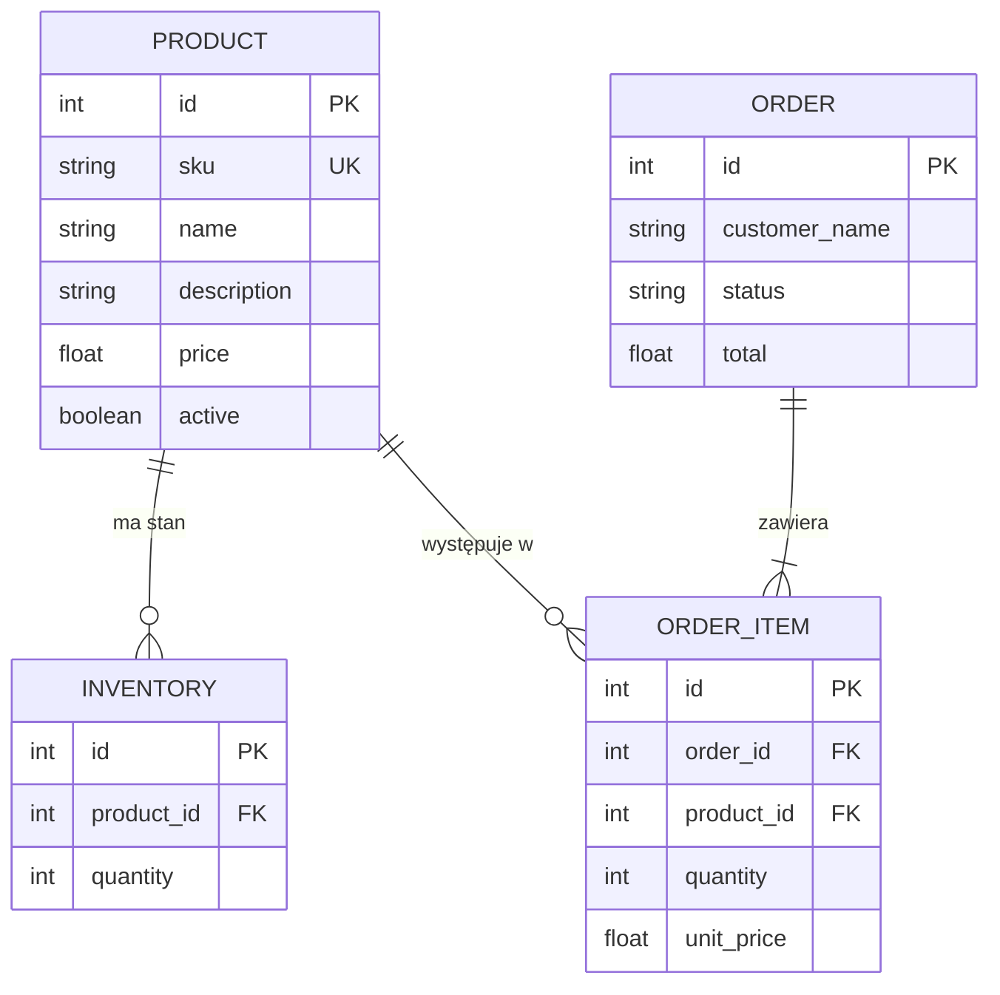

# Rozproszony sklep internetowy

Aplikacja prezentuje sklep z katalogiem produktów replikowanym między dwoma oddziałami: **Katowice** i **Kraków**. Każdy oddział ma własny magazyn oraz własne zamówienia, dzięki czemu awaria jednego węzła nie blokuje odczytu danych drugiego.

## Stack technologiczny

- Python 3.11, Starlette i Uvicorn
- GraphQL: Graphene oraz GraphiQL
- PonyORM
- PostgreSQL 16 w Docker Compose
- SQLite przy uruchomieniu lokalnym

## Architektura i dane

| Dane | Katowice | Kraków | Zasada |
|---|---:|---:|---|
| Produkty | tak | tak | katalog jest replikowany |
| Stany magazynowe | tak | tak | stan jest lokalny dla oddziału |
| Zamówienia | tak | tak | zamówienie jest lokalne dla oddziału |


```mermaid
erDiagram
    PRODUCT ||--o{ INVENTORY : "ma stan"
    PRODUCT ||--o{ ORDER_ITEM : "występuje w"
    ORDER ||--|{ ORDER_ITEM : "zawiera"

    PRODUCT {
        int id PK
        string sku UK
        string name
        string description
        float price
        boolean active
    }
    INVENTORY {
        int id PK
        int product_id FK
        int quantity
    }
    ORDER {
        int id PK
        string customer_name
        string status
        float total
    }
    ORDER_ITEM {
        int id PK
        int order_id FK
        int product_id FK
        int quantity
        float unit_price
    }
```

Produkt usunięty przez `deleteProduct` nie jest fizycznie kasowany — otrzymuje `active=false` w obu replikach. Nieaktywny produkt nie może zostać dodany do nowego zamówienia.

## Role komponentów i granice odpowiedzialności

System ma jeden **serwer centralny aplikacji** (`api`) oraz dwa autonomiczne węzły danych. Serwer centralny nie przechowuje danych biznesowych i nie jest nadrzędną bazą: udostępnia jedno API GraphQL, wybiera węzeł dla operacji lokalnych oraz koordynuje zapisy do obu replik katalogu. Obie bazy PostgreSQL pozostają oddzielne.

| Komponent | Odpowiedzialność | Zakres danych |
|---|---|---|
| `api` | Punkt wejścia GraphQL, walidacja żądań, kierowanie odczytów i zapisów | Nie przechowuje katalogu, magazynu ani zamówień |
| Węzeł Katowice | Lokalna realizacja magazynu i zamówień oddziału | Własna kopia katalogu, magazyn Katowic, zamówienia Katowic |
| Węzeł Kraków | Lokalna realizacja magazynu i zamówień oddziału | Własna kopia katalogu, magazyn Krakowa, zamówienia Krakowa |

Identyfikator węzła w mutacjach `updateInventory` i `createOrder` jest obowiązkowy, dzięki czemu operacje na magazynie i zamówieniach nie przekraczają granicy oddziału. Odczyt `products` korzysta z repliki Katowice; odczyty `inventory(node: ...)` i `orders(node: ...)` dotyczą wybranego węzła.

## Synchronizacja katalogu

Replikowany jest wyłącznie katalog produktów (`products`). Magazyn (`inventory`) oraz zamówienia (`orders`, `order_items`) są danymi lokalnymi i nie podlegają replikacji.

Synchronizacja katalogu odbywa się **synchronicznie w warstwie aplikacji**, podczas obsługi mutacji, a nie przez replikację PostgreSQL ani proces działający w tle:

1. `createProduct` sprawdza dostępność obu baz i zapisuje produkt oraz zerowy stan magazynowy w każdej z nich.
2. `deleteProduct` najpierw odczytuje produkt z obu baz, a potem ustawia `active=false` w obu replikach.
3. `updateInventory` i `createOrder` zapisują dane tylko w węźle przekazanym w parametrze `node`.

Nie ma kolejki zmian, okresowej synchronizacji ani automatycznego mechanizmu naprawy rozbieżności. Zapis katalogu wymaga dostępności obu węzłów; jeśli baza jest niedostępna przed rozpoczęciem zapisu, mutacja zwraca błąd i nie powinna modyfikować dostępnej repliki. Implementacja nie stosuje jednak rozproszonej transakcji dwufazowej, dlatego awaria występująca w trakcie zatwierdzania zapisu wymaga kontroli zgodności replik po odzyskaniu połączenia.

## Zachowanie przy utracie połączenia

| Sytuacja | Zachowanie systemu | Odzyskanie |
|---|---|---|
| Niedostępny Kraków | `products` i zapytania z `node: "KATOWICE"` pozostają dostępne. Zapytanie bez filtra węzła, które wymaga odczytu obu baz, może zwrócić błąd. | Po restarcie bazy aplikacja ponownie korzysta z węzła; seed można uruchomić dla brakujących danych demonstracyjnych. |
| Niedostępne Katowice | API pozostaje uruchomione, ale `products` jest niedostępne, bo ta replika obsługuje ten odczyt. Operacje jawnie wskazujące Kraków mogą działać, o ile nie wymagają zapisu katalogu. | Przywróć bazę Katowic i zweryfikuj zgodność katalogu. |
| Niedostępny dowolny węzeł podczas `createProduct`/`deleteProduct` | Zapis katalogu jest odrzucany; system nie przełącza go na drugi węzeł ani nie odkłada go do późniejszego wykonania. | Powtórzyć mutację po odzyskaniu połączenia; po awarii w trakcie zatwierdzania porównać repliki. |
| Utrata połączenia z `api` | Klienci nie mają dostępu do GraphQL, mimo że bazy mogą nadal działać. | Uruchomić ponownie kontener `api`; dane pozostają w wolumenach PostgreSQL. |

## Wymagania niefunkcjonalne i kryteria weryfikacji

Poniższe wymagania są kryteriami akceptacji dla uruchomienia Docker Compose na komputerze testowym. Wyniki i czasy należy zapisać w raporcie `Tests/results/report.html`; nie są to deklarowane stałe SLA dla dowolnego sprzętu.

| Obszar | Mierzalne wymaganie | Sposób weryfikacji |
|---|---|---|
| Poprawność replikacji | Po `createProduct` ten sam SKU musi istnieć w obu bazach; po `updateInventory(..., node: "KATOWICE")` ilość w Krakowie musi pozostać `0`. | Scenariusz `6.3` (`python -m Tests.run_tests`). |
| Odporność na awarię węzła | Po zatrzymaniu `postgres_krakow` odczyt katalogu i `inventory(node: "KATOWICE")` muszą zakończyć się bez błędu; po ponownym uruchomieniu Krakowa oba węzły muszą odpowiadać. | Scenariusz `6.4`, uruchamiany z hosta. |
| Poprawność pod obciążeniem | Dla 1, 10 i 100 kolejnych odczytów katalogu liczba odpowiedzi z błędem musi wynosić `0`; raport rejestruje czas całkowity i średni. | Scenariusz `6.2`. |
| Kompletność odczytu przy skali | Dla 100, 1 000 i 10 000 produktów testowych odpowiedź `products` nie może zawierać błędu i musi zawierać dokładnie tyle produktów `PERF-*`, ile utworzono. | Scenariusze `6.1` i `6.5`. |
| Obserwowalność testów | Każde uruchomienie zestawu ma wygenerować `report.html`, `report.json` i `measurements.csv`, z wynikiem PASS/FAIL i pomiarami każdego scenariusza. | Sprawdzić pliki w `Tests/results/` albo endpoint `/reports/tests`. |

## Usługi Docker Compose

| Usługa | Rola | Port hosta |
|---|---|---:|
| `api` | API Starlette i GraphQL | `8000` |
| `postgres_katowice` | baza oddziału Katowice | `5433` |
| `postgres_krakow` | baza oddziału Kraków | `5434` |
| `seed_database` | jednorazowe zasilenie danych | — |
| `test_runner` | ręcznie uruchamiane testy | — |

`test_runner` należy do profilu `tests`, więc zwykłe uruchomienie aplikacji go nie startuje.

## Szybki start przez Docker

Wymagane są Docker Desktop oraz Docker Compose.

```bash
docker compose up -d --build
```

Przy pierwszym uruchomieniu Compose:

1. uruchamia obie bazy PostgreSQL;
2. PonyORM tworzy tabele;
3. `seed_database` zapisuje dane demonstracyjne;
4. startuje API.

Sprawdź status:

```bash
docker compose ps
```

Adresy aplikacji:

| Zasób | Adres |
|---|---|
| GraphiQL / GraphQL | `http://localhost:8000/graphql` |
| Health check | `http://localhost:8000/health` |
| Raport testów HTML | `http://localhost:8000/reports/tests` |

Logi usług:

```bash
docker compose logs -f api
docker compose logs seed_database
```

Zatrzymanie usług bez usuwania danych:

```bash
docker compose down
```

Reset baz wraz z wolumenami — **usuwa wszystkie dane PostgreSQL**:

```bash
docker compose down -v
docker compose up -d --build
```

### Odzyskanie ręcznie usuniętej bazy PostgreSQL

Zmienne `POSTGRES_DB` tworzą bazę tylko przy inicjalizacji pustego wolumenu. Jeśli baza została usunięta w pgAdmin, wykonaj pełny reset wolumenów powyżej albo utwórz bazę ponownie w pgAdmin jako właściciel `sklep`:

```text
sklep_katowice  — serwer localhost:5433
sklep_krakow    — serwer localhost:5434
```

Następnie uruchom seed:

```bash
docker compose run --rm seed_database
```

## Seed danych

Seed jest idempotentny: tworzy brakujące rekordy, ale nie nadpisuje istniejącego stanu magazynowego ani flagi `active`.

Na świeżej bazie każdy oddział otrzymuje co najmniej 30 rekordów w tabelach:

- `products`,
- `inventory`,
- `orders`,
- `order_items`.

Ręczne uruchomienie seeda:

```bash
docker compose run --rm seed_database
```

## Lokalne uruchomienie bez Dockera

Lokalna aplikacja używa plików SQLite w `data/`.

```bash
pip install -r requirements.txt
python -m backend.seed_database
python backend/app.py
```

Lokalne API będzie dostępne pod `http://127.0.0.1:8000/graphql`.

## GraphQL — przykłady

Pełny zbiór gotowych do wklejenia zapytań i mutacji znajduje się w pliku [api_przyklady.md](api_przyklady.md).

Odczyt katalogu i stanów magazynowych:

```graphql
{
  products {
    sku
    name
    price
    active
  }
  inventory {
    node
    quantity
    product { sku name }
  }
}
```

Utworzenie produktu w obu replikach katalogu:

```graphql
mutation {
  createProduct(product: {
    sku: "LAP-999"
    name: "Laptop demonstracyjny"
    description: "Produkt testowy"
    price: 1999.99
  }) {
    ok
    message
  }
}
```

Utworzenie lokalnego zamówienia w Katowicach:

```graphql
mutation {
  createOrder(
    node: "KATOWICE"
    customerName: "Jan Kowalski"
    items: [{ sku: "LAP-001", quantity: 1 }]
  ) {
    ok
    order { id node total status }
  }
}
```

## Testy i raport HTML

Testy integracyjne obejmują czas odpowiedzi, obciążenie, spójność danych, awarię Krakowa oraz skalowalność.

### Z hosta — pełny zestaw

```bash
python -m Tests.run_tests
```

To uruchomienie zawiera test awarii, który tymczasowo zatrzymuje kontener `postgres_krakow`.

### W kontenerze — profil opcjonalny

```bash
docker compose --profile tests run --rm test_runner
```

Kontener `test_runner` nie jest uruchamiany domyślnie i wykonuje bezpieczny zestaw bez testu awarii (`6.4`).

Po zakończeniu testów powstają:

```text
Tests/results/report.html
Tests/results/report.json
Tests/results/measurements.csv
```

Raport HTML jest responsywny, zawiera podsumowanie PASS/FAIL, cel i metodę każdego scenariusza, wyniki pomiarów oraz wnioski. Jest dostępny w przeglądarce pod `http://localhost:8000/reports/tests`. Gdy raport nie został jeszcze wygenerowany, endpoint zwraca `404`.

Szczegóły organizacji testów znajdują się w [Tests/README.md](Tests/README.md).
